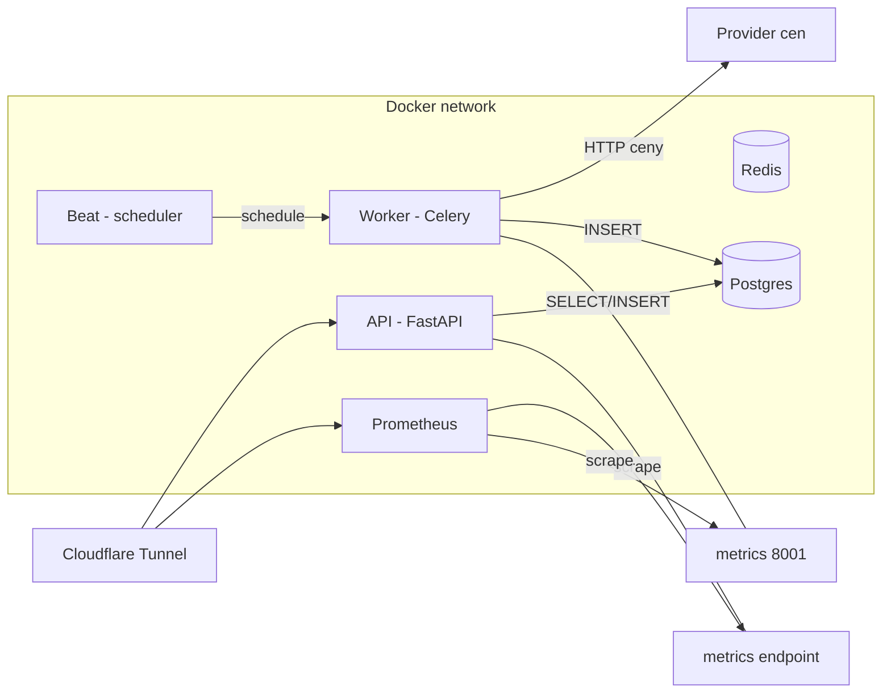
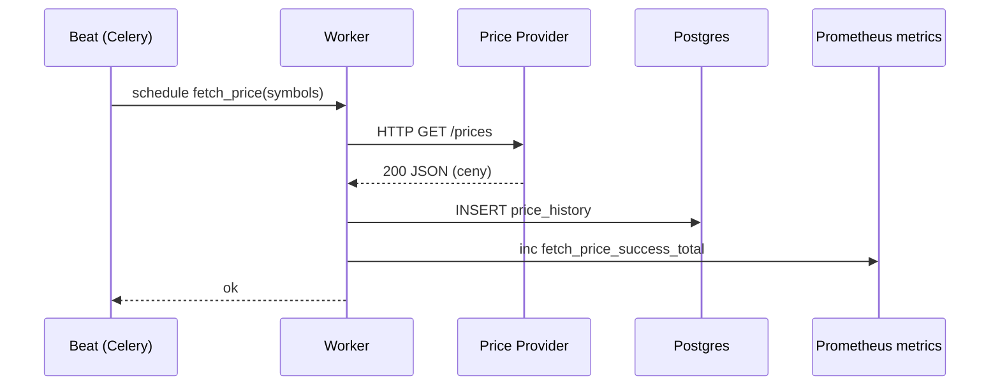
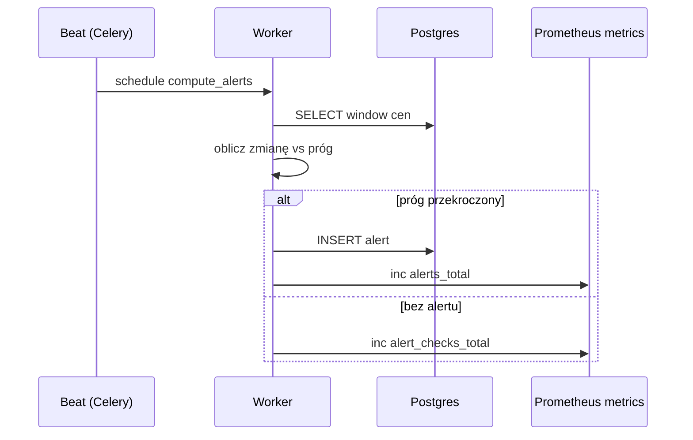
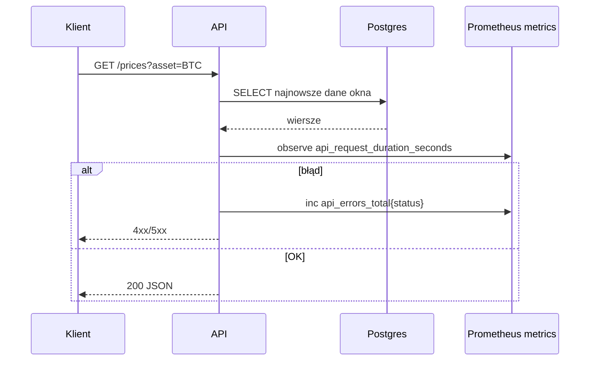
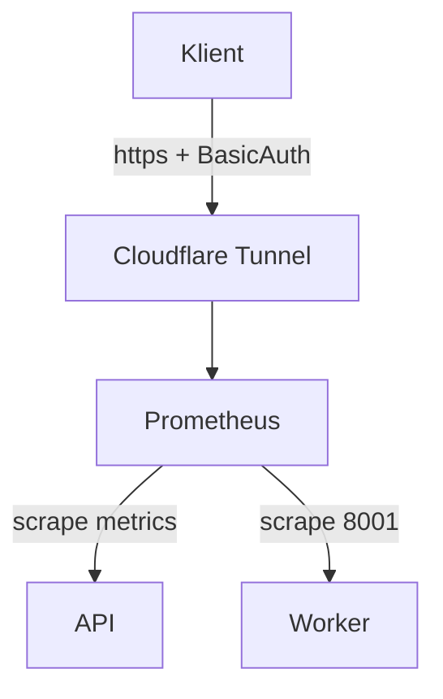

# Diagramy przepływu danych (Mermaid)

Poniżej zestaw kluczowych przepływów jako diagramy Mermaid. Można je podejrzeć w VS Code (rozszerzenia Mermaid) lub w przeglądarce (np. GitHub renderuje podstawowe diagramy).

## 1) Przepływ wysokopoziomowy (architektura runtime)

## 2) Zadanie pobierania cen (worker)

## 3) Obliczanie alertów (worker)

## 4) Zapytanie API i metryki

## 5) Tunel + Prometheus Basic Auth + scrape

---

Wskazówki operacyjne:
- Basic Auth wymaga uruchomienia z override `ops/compose.prometheus-auth.yml` (dodaje `--web.config.file` i montuje `ops/prometheus/web.yml`).
- Tunel: tryb tokenowy (`CLOUDFLARE_TUNNEL_TOKEN`) lub plik `ops/cloudflared/<UUID>.json` + `ops/cloudflared/config.yml`.
- Tryb bez publicznych portów: dołącz `ops/compose.tunnel.yml` (usuwa `ports:` z API/Prometheus).
